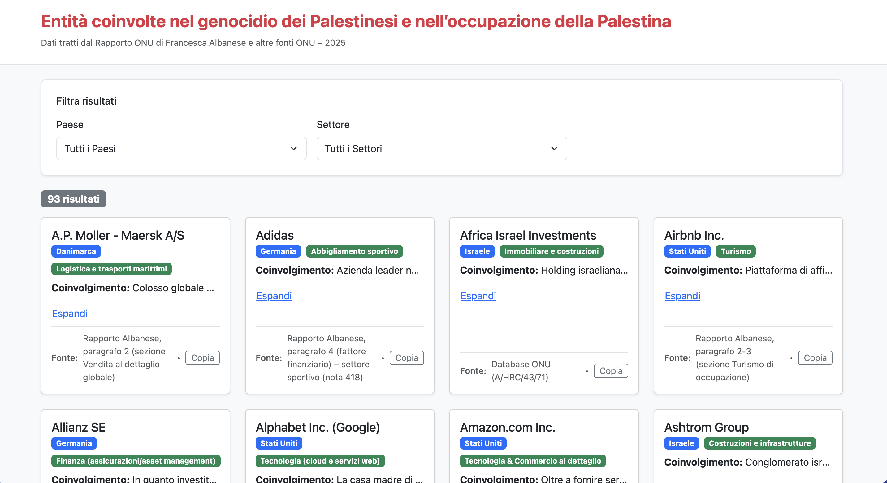

# 📊 Entità Coinvolte nel Genocidio e nell’Occupazione della Palestina

> Dati tratti dal **Rapporto ONU di Francesca Albanese** e altre fonti ufficiali – 2025

---

## 🚀 Funzionalità

- **Filtraggio dinamico** per **Paese** e **Settore**
- **Conteggio risultati** aggiornato in tempo reale
- **Interfaccia responsive** ottimizzata per mobile, tablet e desktop
- **Design moderno** con **Bootstrap 5** + **TailwindCSS**
- **Card informative** con pulsanti per filtrare rapidamente
- **Collegamento diretto al PDF ufficiale del Rapporto ONU**
- **Footer** con:
  - Licenza **Creative Commons CC BY-NC-SA 4.0**
  - Link a Privacy & Cookie Policy
  - Contatti e link al repository
  - Indicatore di versione

---

## 📷 Screenshot



---

## 🛠 Tecnologie utilizzate

- **React 18**
- **Bootstrap 5**
- **TailwindCSS**
- **Netlify** (hosting)
- **JavaScript (ES2020)**

---

## 📦 Installazione

Clona il repository e installa le dipendenze:

```bash
git clone https://github.com/tuo-utente/tuo-repo.git
cd tuo-repo
npm install
```

---

## ▶️ Avvio locale

```bash
npm start
```

L’app sarà disponibile su `http://localhost:3000`.

---

## 🌐 Deploy su Netlify

1. Collega il repository a Netlify
2. Imposta il comando di build:
   ```
   npm run build
   ```
3. Imposta la cartella di pubblicazione:
   ```
   build
   ```
4. Pubblica 🎉

---

## 📄 Licenza

Questo progetto è rilasciato sotto **Creative Commons Attribution-NonCommercial-ShareAlike 4.0 International (CC BY-NC-SA 4.0)**.


---

## 📬 Contatti

- **Autore:** Michele Minno  
- **Email:** [michele@example.org](mailto:michele@example.org)  
- **Repository:** [GitHub](https://github.com/tuo-utente/tuo-repo)

---
